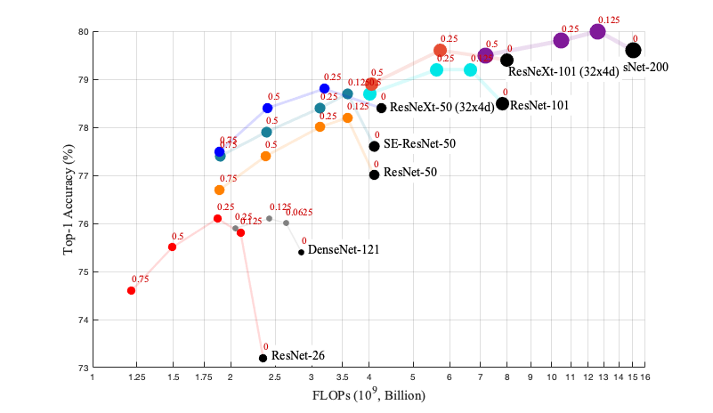

# Octave Convolution
MXNet implementation for:

[Drop an Octave: Reducing Spatial Redundancy in Convolutional Neural Networks with Octave Convolution](https://arxiv.org/abs/1904.05049)

## Install Dependencies

- Install dependencies using requirements.txt

```shell
pip install -r requirements.txt
```

## ImageNet

### Ablation
- Loss: Softmax
- Learning rate: Cosine (warm-up: 5 epochs, lr: 0.4)
- MXNet API: [Symbol API](https://mxnet.incubator.apache.org/api/python/symbol.html)



|     Model    |   baseline  |  alpha = 0.125  |  alpha = 0.25   |   alpha = 0.5   |  alpha = 0.75   |
|:------------:|:-----------:|:---------------:|:---------------:|:---------------:|:---------------:|
| DenseNet-121 | 75.4 / 92.7 | [76.1 / 93.0](https://dl.fbaipublicfiles.com/octconv/ablation/a01_densenet-121_alpha-0.125.tar) | [75.9 / 93.1](https://dl.fbaipublicfiles.com/octconv/ablation/a01_densenet-121_alpha-0.250.tar) |        --       |        --       |
|  ResNet-26   | 73.2 / 91.3 | [75.8 / 92.6](https://dl.fbaipublicfiles.com/octconv/ablation/a02_resnet-26_alpha-0.125.tar) | [76.1 / 92.6](https://dl.fbaipublicfiles.com/octconv/ablation/a02_resnet-26_alpha-0.250.tar) | [75.5 / 92.5](https://dl.fbaipublicfiles.com/octconv/ablation/a02_resnet-26_alpha-0.500.tar) | [74.6 / 92.1](https://dl.fbaipublicfiles.com/octconv/ablation/a02_resnet-26_alpha-0.750.tar) |
|  ResNet-50   | 77.0 / 93.4 | [78.2 / 93.9](https://dl.fbaipublicfiles.com/octconv/ablation/a03_resnet-50_alpha-0.125.tar) | [78.0 / 93.8](https://dl.fbaipublicfiles.com/octconv/ablation/a03_resnet-50_alpha-0.250.tar) | [77.4 / 93.6](https://dl.fbaipublicfiles.com/octconv/ablation/a03_resnet-50_alpha-0.500.tar) | [76.7 / 93.0](https://dl.fbaipublicfiles.com/octconv/ablation/a03_resnet-50_alpha-0.750.tar) |
| SE-ResNet-50 | 77.6 / 93.6 | [78.7 / 94.1](https://dl.fbaipublicfiles.com/octconv/ablation/a05_se-resnet-50_alpha-0.125.tar) | [78.4 / 94.0](https://dl.fbaipublicfiles.com/octconv/ablation/a05_se-resnet-50_alpha-0.250.tar) | [77.9 / 93.8](https://dl.fbaipublicfiles.com/octconv/ablation/a05_se-resnet-50_alpha-0.500.tar) | [77.4 / 93.5](https://dl.fbaipublicfiles.com/octconv/ablation/a05_se-resnet-50_alpha-0.750.tar) |
|  ResNeXt-50  | 78.4 / 94.0 |       --        | [78.8 / 94.2](https://dl.fbaipublicfiles.com/octconv/ablation/a04_resnext-50_32x4d_alpha-0.250.tar) | [78.4 / 94.0](https://dl.fbaipublicfiles.com/octconv/ablation/a04_resnext-50_32x4d_alpha-0.500.tar) | [77.5 / 93.6](https://dl.fbaipublicfiles.com/octconv/ablation/a04_resnext-50_32x4d_alpha-0.750.tar) |
|  ResNet-101  | 78.5 / 94.1 | [79.2 / 94.4](https://dl.fbaipublicfiles.com/octconv/ablation/a06_resnet-101_alpha-0.125.tar) | [79.2 / 94.4](https://dl.fbaipublicfiles.com/octconv/ablation/a06_resnet-101_alpha-0.250.tar) | [78.7 / 94.1](https://dl.fbaipublicfiles.com/octconv/ablation/a06_resnet-101_alpha-0.500.tar) |       --        |
|  ResNeXt-101 | 79.4 / 94.6 |       --        | [79.6 / 94.5](https://dl.fbaipublicfiles.com/octconv/ablation/a07_resnext-101_32x4d_alpha-0.250.tar) | [78.9 / 94.4](https://dl.fbaipublicfiles.com/octconv/ablation/a07_resnext-101_32x4d_alpha-0.500.tar) |       --        |
|  ResNet-200  | 79.6 / 94.7 | [80.0 / 94.9](https://dl.fbaipublicfiles.com/octconv/ablation/a08_resnet-200_alpha-0.125.tar) | [79.8 / 94.8](https://dl.fbaipublicfiles.com/octconv/ablation/a08_resnet-200_alpha-0.250.tar) | [79.5 / 94.7](https://dl.fbaipublicfiles.com/octconv/ablation/a08_resnet-200_alpha-0.500.tar) |       --        |

Note:
- Top-1 / Top-5, single center crop accuracy is shown in the table. ([testing script](utils/symbol/score.py))
- All residual networks in ablation study adopt pre-actice version[1] for convenience.


### Others
- Learning rate: Cosine (warm-up: 5 epochs, lr: 0.4)
- MXNet API: [Gluon API](https://mxnet.incubator.apache.org/api/python/gluon/nn.html)

|         Model        | alpha | label smoothing[2] | mixup[3] |#Params | #FLOPs |  Top1 / Top5 |
|:--------------------:|:-----:|:------------------:|:--------:|:------:|:------:|:------------:|
| 0.75  MobileNet (v1) |  .375 |                    |          |  2.6 M |  213 M | [70.5 / 89.5](https://dl.fbaipublicfiles.com/octconv/others/mobilenet_v1_075_alpha-0.375.params) |
| 1.0   MobileNet (v1) |  .5   |                    |          |  4.2 M |  321 M | [72.5 / 90.6](https://dl.fbaipublicfiles.com/octconv/others/mobilenet_v1_100_alpha-0.5.params) |
| 1.0   MobileNet (v2) |  .375 |         Yes        |          |  3.5 M |  256 M | [72.0 / 90.7](https://dl.fbaipublicfiles.com/octconv/others/mobilenet_v2_100_alpha-0.375.params) |
| 1.125 MobileNet (v2) |  .5   |         Yes        |          |  4.2 M |  295 M | [73.0 / 91.2](https://dl.fbaipublicfiles.com/octconv/others/mobilenet_v2_1125_alpha-0.5.params) |
| Oct-ResNet-152       |  .125 |         Yes        |    Yes   | 60.2 M | 10.9 G | [81.4 / 95.4](https://dl.fbaipublicfiles.com/octconv/others/resnet152_v1f_alpha-0.125.params) |
| Oct-ResNet-152 + SE  |  .125 |         Yes        |    Yes   | 66.8 M | 10.9 G | [81.6 / 95.7](https://dl.fbaipublicfiles.com/octconv/others/se-resnet152_v1e_alpha-0.125.params) |


## Citation
```
@article{chen2019drop,
  title={Drop an Octave: Reducing Spatial Redundancy in Convolutional Neural Networks with Octave Convolution},
  author={Chen, Yunpeng and Fan, Haoqi and Xu, Bing and Yan, Zhicheng and Kalantidis, Yannis and Rohrbach, Marcus and Yan, Shuicheng and Feng, Jiashi},
  journal={Proceedings of the IEEE International Conference on Computer Vision},
  year={2019}
}
```


## Third-party Implementations

- [PyTorch Implementation](https://github.com/d-li14/octconv.pytorch) **with imagenet training log and pre-trained model** by [d-li14](https://github.com/d-li14)
- [MXNet Implementation](https://github.com/terrychenism/OctaveConv) **with imagenet training log** by [terrychenism](https://github.com/terrychenism)
- [Keras Implementation](https://github.com/koshian2/OctConv-TFKeras) **with cifar10 results** by [koshian2](https://github.com/koshian2)


## Acknowledgement
- Thanks [MXNet](https://mxnet.incubator.apache.org/), [Gluon-CV](https://gluon-cv.mxnet.io/) and [TVM](https://tvm.ai/)!
- Thanks [@Ldpe2G](https://github.com/Ldpe2G) for sharing the code for calculating the #FLOPs \([`link`](https://github.com/Ldpe2G/DeepLearningForFun/tree/master/Mxnet-Scala/UsefulTools)\)
- Thanks Min Lin (Mila), Xin Zhao (Qihoo Inc.), Tao Wang (NUS) for helpful discussions on the code development.


## Reference
[1] He K, et al "Identity Mappings in Deep Residual Networks".

[2] Christian S, et al "Rethinking the Inception Architecture for Computer Vision"

[3] Zhang H, et al. "mixup: Beyond empirical risk minimization.".

## License
The code and the models are MIT licensed, as found in the LICENSE file.
